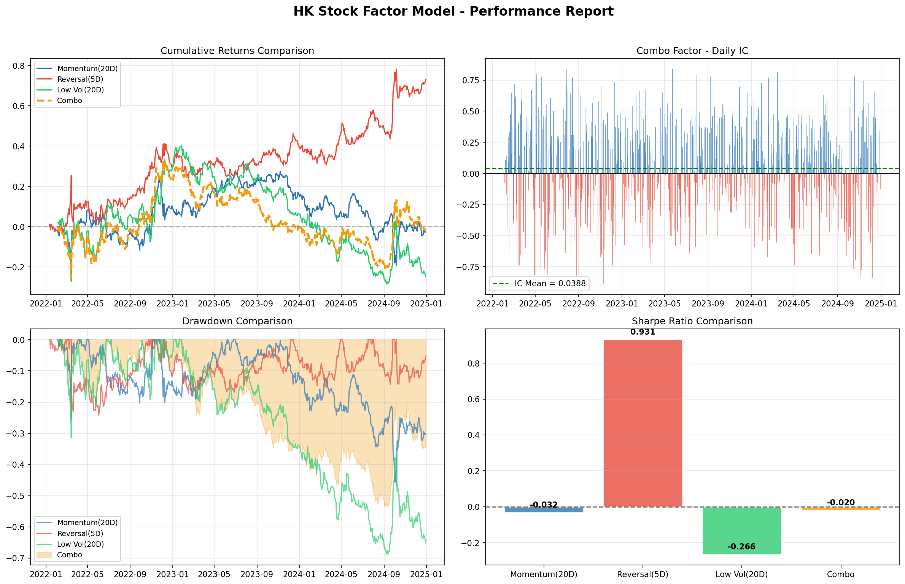

# HK Stock Multi-Factor Model / 港股多因子模型

A factor-based long-short equity strategy backtested on 20 Hang Seng constituent stocks.

基于20只恒生指数成分股的因子多空策略回测系统。

---

## What This Does / 项目简介

Downloads 2 years of daily price data for 20 Hong Kong stocks, constructs three classic equity factors, combines them into a multi-factor model, and evaluates performance using industry-standard metrics.

下载20只港股两年的日线数据，构建三个经典股票因子，组合为多因子模型，并使用行业标准指标评估表现。

---

## Factors / 因子说明

| Factor / 因子 | Logic / 逻辑 | Window / 窗口 |
|--------|-------|--------|
| **Momentum / 动量** | Stocks that went up tend to keep going up / 过去涨的股票倾向于继续涨 | 20 days / 20天 |
| **Short-term Reversal / 短期反转** | Stocks that dropped sharply tend to bounce back / 短期急跌的股票倾向于反弹 | 5 days / 5天 |
| **Low Volatility / 低波动率** | Less volatile stocks tend to outperform / 波动率低的股票收益反而更高 | 20 days / 20天 |
| **Combo / 组合因子** | Equal-weighted z-score combination of all three / 三个因子等权z-score组合 | — |

---

## Strategy / 策略逻辑

- Each day, rank all 20 stocks by factor value / 每天按因子值对20只股票排名
- Go long the top 5 (strongest signal) / 做多排名前5（信号最强）
- Go short the bottom 5 (weakest signal) / 做空排名后5（信号最弱）
- Equal-weight positions within each leg / 组内等权配置
- 1-day lag to avoid look-ahead bias / 延迟1天避免前瞻偏差

---

## Key Metrics / 核心指标

| Metric / 指标 | Description / 说明 |
|--------|--------|
| **Annualized Return / 年化收益** | Mean daily return × 252 / 日均收益 × 252 |
| **Sharpe Ratio / 夏普比率** | Annualized return / annualized volatility / 年化收益 / 年化波动率 |
| **Maximum Drawdown / 最大回撤** | Largest peak-to-trough decline / 从最高点到最低点的最大跌幅 |
| **Rank IC** | Daily Spearman correlation between factor values and next-day returns / 因子值与次日收益的每日Spearman相关系数 |
| **ICIR** | IC mean / IC std, the signal's information ratio / IC均值 / IC标准差，信号的信噪比 |

---

## Results / 研究发现

The Reversal factor showed the strongest standalone performance with low correlation to the Hang Seng Index, suggesting genuine market-neutral alpha. The Combo factor improved stability (lower drawdown) compared to individual factors, though its absolute return was diluted by weaker components.

反转因子表现最强，且与恒生指数走势相关性低，具有真正的市场中性Alpha。组合因子相比单因子降低了回撤、提升了稳定性，但绝对收益被较弱的因子稀释。



---

## Setup / 运行方法

```bash
pip install pandas numpy matplotlib yfinance scipy
python3 factor_model.py
```

---

## Project Structure / 项目结构

```
├── factor_model.py        # Main script / 主代码
├── factor_report.png      # Output chart / 输出图表
└── README.md
```

---

## What I Learned / 学到了什么

- **Log returns are additive** — simple returns are not, making cumulative calculations cleaner.
  **对数收益率可加** — 普通收益率不行，这让累计收益的计算更简洁。

- **The √T rule** — annualizing volatility uses √252 instead of 252, because variance (not std) is additive under IID.
  **√T法则** — 年化波动率用√252而不是252，因为在IID假设下可加的是方差而不是标准差。

- **Cross-sectional z-score** — necessary before combining factors with different scales into one composite signal.
  **截面z-score标准化** — 在将不同量纲的因子合成一个综合信号之前必须做标准化。

- **Rank IC (Spearman)** — more robust than Pearson IC for evaluating factor predictiveness, because it is not affected by outliers.
  **Rank IC (Spearman)** — 比Pearson IC更稳健，因为不受极端值影响。

- **Parameter sensitivity** — the optimal momentum lookback window is unstable across different periods, highlighting overfitting risk.
  **参数敏感性** — 动量因子的最优回看窗口在不同时段不稳定，说明存在过拟合风险。

---

## Next Steps / 下一步计划

- Optimize factor weights using ridge regression instead of equal weighting (Project 02)
  使用岭回归优化因子权重，取代等权组合（Project 02）

- Add out-of-sample validation to guard against overfitting
  加入样本外验证防止过拟合

- Expand the stock universe beyond 20 names for more robust results
  扩大股票池至20只以上，使结果更稳健

- Explore dynamic lookback windows that adapt to market regime
  探索根据市场状态动态调整的回看窗口
